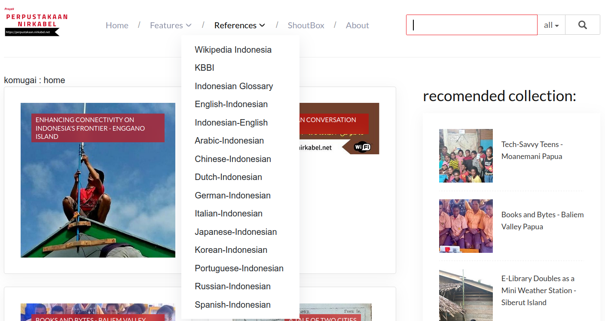
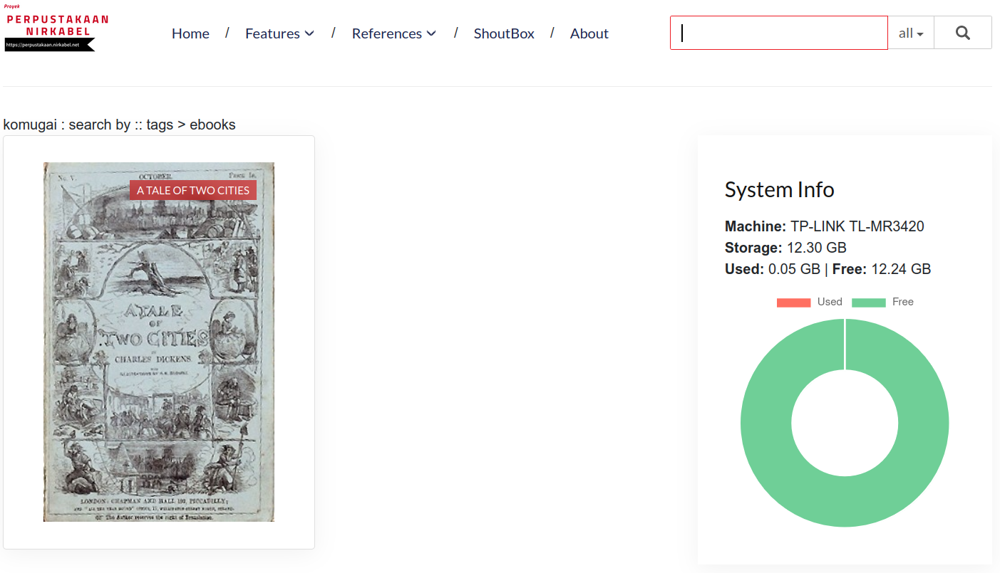
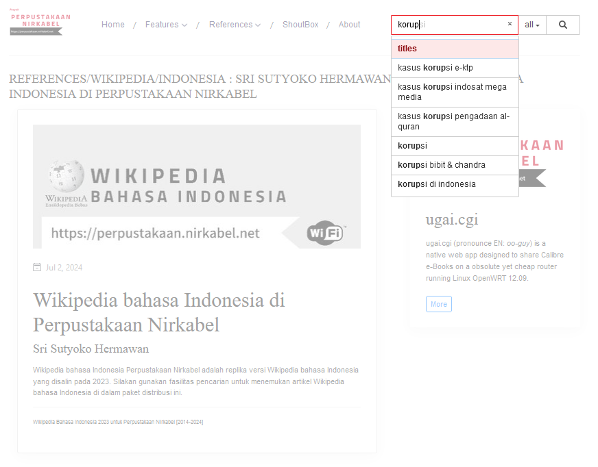
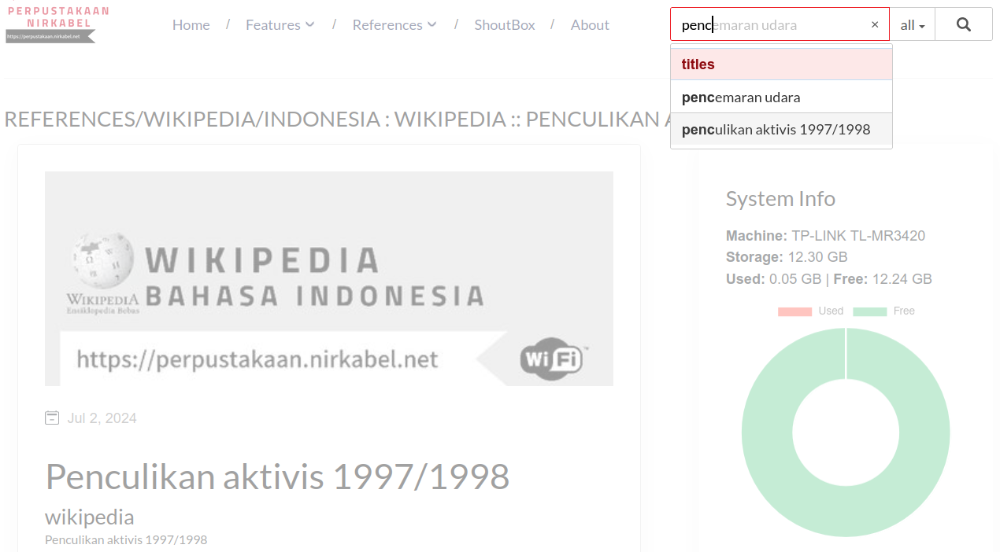

# Ugai.cgi



**Mengubah router rombengan menjadi sekolah digital mandiri dengan `ugai.cgi`**

Jika Anda ingin membuat penyimpanan digital di rumah untuk koleksi pribadi, berbagi hanya dengan keluarga atau tamu (bukan dengan orang asing di media sosial), `ugai.cgi` adalah pilihan yang tepat. Ini juga ideal untuk guru dan pelatih, menawarkan alternatif yang terjangkau untuk papan tulis dan proyektor mahal, mengubah smartphone menjadi layar presentasi kecil.

Diucapkan *ooh-guy*, aplikasi ini memungkinkan berbagi koleksi multimedia dengan cepat melalui router lama apa saja. Dengan `ugai.cgi`, Anda dapat mendirikan server nirkabel Calibre yang portabel dalam waktu kurang dari satu menit. Tidak diperlukan keahlian IT tingkat lanjut! Cukup ketik *4 perintah sederhana* di terminal.

Lahir dari satu dekade pengalaman dalam menciptakan perpustakaan digital nirkabel untuk komunitas terpencil di Indonesia, inovasi hemat biaya ini hanya berharga sekitar $10 per unit. Sempurna untuk relawan dan pendidik di daerah yang kekurangan sumber daya, `ugai.cgi` lebih dari sekadar rak buku digital; ini juga menyediakan pengalaman belajar ala Instagram, membuat pendidikan menjadi mudah diakses dan menarik.

[](http://www.youtube.com/watch?v=q8KNBix4JUY "Installation Video")

Video ini sengaja disajikan tanpa suara, mengikuti prinsip bahwa 'tindakan lebih telak daripada kata'. Silakan aktifkan teks tertutup untuk deskripsi rinci dari tindakan yang ditampilkan di layar. Teks tertutup tersedia dalam beberapa bahasa, dengan Bahasa Indonesia sebagai pengaturan default.

Apa yang menarik?
=================

Temukan fitur unik dari sistem ini dibandingkan dengan sistem server nirkabel lainnya yang menggunakan router sebagai server web mini:

- **Gampang dipasang**: Mulai dan beroperasi dalam waktu kurang dari satu menit! Dengan hanya empat baris perintah sederhana di konsol, bahkan pemula pun dapat dengan mudah menyiapkan `ugai.cgi`.

- **Mudah diatur-ulang**: Ucapkan selamat tinggal pada pengaturan yang rumit! `ugai.cgi` beroperasi langsung pada perangkat keras tanpa memerlukan sistem `rootfs`. Sempurna untuk pemula, ini menyederhanakan proses dan meningkatkan efisiensi energi.

- **Luwes**: Apakah Anda menggunakan partisi EXT4 atau FAT32, `ugai.cgi` bekerja dengan mulus dengan semua sistem operasi modern. Dapat menangani hingga 1TB (teruji) dan maksimum 2TB (batas partisi MBR), modifikasi konten menjadi sangat mudah.

- **Mengguakan Calibre**: Kelola konten digital Anda dengan mudah dengan integrasi Calibre. Sistem ini menawarkan antarmuka yang ramah pengguna melalui aplikasi desktop Calibre versi 3.4.80.

- **Cepat**: `ugai.cgi`, yang dioptimalkan untuk Linux OpenWRT 12.09, berjalan secara native tanpa memerlukan interpreter seperti Python, Perl, atau PHP. Ini menghasilkan kinerja yang jauh lebih cepat dan konsumsi energi yang lebih rendah.

- **Koleksi Simultan**: Edisi 2024 dari `ugai.cgi` dapat menangani beberapa basis data Calibre secara bersamaan. Ini meningkatkan kinerja dengan mendistribusikan data di berbagai basis data, sempurna untuk mengelola koleksi besar dalam batas partisi MBR.

- **Sarana Merangkap Prasarana Belajar**: Kode server web `ugai.cgi` dan aplikasi shoutbox `ugai.kom` tersedia gratis di bawah lisensi MIT. Ini menyediakan sumber daya yang sangat baik bagi siswa untuk belajar HTML, CSS, JavaScript, dan manajemen server—biaya efektif, hemat energi, dan cepat untuk dikerahkan.

Yuk Mulai
=========
### Firmware

Unduh firmware OpenWRT 12.09 yang mencakup integrasi pembaca media USB/HDD di kernel untuk menyederhanakan instalasi. Pilih firmware yang sesuai untuk router Anda. Pemasangan yang salah pada tahap ini dapat merusak router Anda secara permanen (`bricked`). Berikut adalah router yang direkomendasikan berdasarkan pengalaman nyata, efektivitas biaya, dan kemudahan penggunaan.

* [TP-Link MR3420 V1 FAT32](http://stable.openwrt.piratebox.de/usb_only/openwrt-ar71xx-generic-tl-mr3420-v1-squashfs-factory.bin)
Alat ini paling ekonomis untuk mengelola hingga 128GB pada USB flash drive dan hingga 250GB pada hard drive. Harganya hanya total 18 dolar AS dengan hardisk SATA baru 320GB. Jika Anda menggunakan hardisk SATA bekas, biaya ini akan lebih murah.

* [TP-Link WR1043nd V1 FAT32](http://stable.openwrt.piratebox.de/usb_only/openwrt-ar71xx-generic-tl-wr1043nd-v1-squashfs-factory.bin) | [TP-Link WR1043nd V1 EXT4](http://stable.openwrt.piratebox.de/ar71xx_AA_BB_0.1/openwrt-ar71xx-generic-tl-wr1043nd-v1-squashfs-factory.bin)   
Perangkat ini cocok untuk penggunaan berat dengan kebutuhan data hingga 1TB.

* [TP-Link MR3020 V1 FAT32](http://stable.openwrt.piratebox.de/usb_only/openwrt-ar71xx-generic-tl-mr3020-v1-squashfs-factory.bin) | [TP-Link MR3020 V1 EXT4](http://stable.openwrt.piratebox.de/ar71xx_AA_BB_0.1/openwrt-ar71xx-generic-tl-mr3020-v1-squashfs-factory.bin)     
Ideal untuk membuat server nirkabel mobile yang ditenagai oleh power bank atau server nirkabel statis yang berjalan pada panel surya dengan paket baterai kecil. MR3020 mengonsumsi sekitar 1-watt-jam. Karena ugai.cgi tidak beroperasi menggunakan metode rootfs, ada peluang minimal kegagalan sistem jika terjadi pemadaman listrik mendadak atau penurunan arus. Anda dapat lebih percaya diri menggunakan `ugai.cgi` untuk menjalankan perpustakaan digital nirkabel di pulau terpencil dengan hanya panel surya sebagai sumber daya Anda, dibandingkan dengan sistem lain yang beroperasi melalui `rootfs`.

[Video ini menunjukkan secara tepat bagaimana cara mem-flash.](https://youtu.be/q8KNBix4JUY?si=8PgCVmA1Cq0cCT60&t=14)

### Media Simpan

Sistem `ugai.cgi` menangani beragam ukuran. Namun, kinerja menurun ketika satu sistem basis data Calibre melebihi 7.000 koleksi, masing-masing dengan lebih dari 10 kata kunci. Tetapi Anda dapat membagi koleksi Anda ke dalam sistem basis data Calibre yang berbeda. Misalkan Anda memiliki 1TB dan ratusan ribu video, musik, ebook; maka Anda dapat membaginya berdasarkan jenis media. Jika koleksi Anda, misalnya video, melebihi 7.000, maka Anda dapat membagi video berdasarkan subjek. Oleh karena itu, pilihan media penyimpanan lebih bergantung pada kemampuan router untuk menyediakan daya.

Umumnya, hanya WR1043nd yang cukup stabil untuk menggunakan hard disk SATA 2,5 inci, asalkan konsumsi dayanya di bawah 1.000 mA. MR3420 dapat menangani hard disk SATA 2,5 inci hingga 320GB. MR3020 cocok untuk penggunaan drive USB hingga 128GB.

Format media penyimpanan dengan sistem FAT32 dalam satu partisi.

### Unduh Kode

#### Untuk MacOS/Linux

Buka terminal dan ketik:

```bash
git clone https://github.com/undix/ugai.git
```

#### Untuk Windows 10

##### Menggunakan Git dari Microsoft Windows PowerShell:

```bash
Windows PowerShell
Copyright (C) Microsoft Corporation. All rights reserved.

Install the latest PowerShell for new features and improvements! https://aka.ms/PSWindows

PS C:\Users\srisu> cd F:\
PS F:\> git clone https://github.com/undix/ugai.git
Cloning into 'ugai'...
remote: Enumerating objects: 732, done.
remote: Counting objects: 100% (370/370), done.
remote: Compressing objects: 100% (258/258), done.
remote: Total 732 (delta 139), reused 239 (delta 94), pack-reused 362
Receiving objects: 100% (732/732), 14.13 MiB | 802.00 KiB/s, done.
Resolving deltas: 100% (223/223), done.
Updating files: 100% (196/196), done.
PS F:\>
```

#### Menggunakan tautan dari browser

* Klik [https://github.com/undix/ugai/archive/refs/heads/main.zip](https://github.com/undix/ugai/archive/refs/heads/main.zip)
* Ekstrak dan ubah nama direktori menjadi `ugai`. Pastikan struktur direktori pada media penyimpanan sebagai berikut:

```text
ugai
├── documents
├── install
└── www
```

### Konfigurasi

#### config.txt

Pengguna dapat memodifikasi berkas konfigurasi bernama `config.txt` menggunakan editor teks seperti Notepad. Pengaturan demo default adalah sebagai berikut:

```text
current_ip_address='192.168.1.1'        # OpenWRT default
my_ip_address='192.168.1.1'             # your new ip address, default 192.168.1.1
my_time_zone='WIB-9'                    # change to your actual timezone, default UTC+9
my_server_domain='komugai.lan'          # domain and hostname
my_ssid="'Komugai'"                     # SSID change as you pleased
my_ssid_passwd="none"                   # SSID password, default none means passwordless
my_partition='/dev/sda1'                # your partition, do not change unless necessary
my_mount_point='/mnt/usb'               # your mount point, do not change unless necessary
my_format='vfat'                        # vfat OR ext4 
my_max_clients=32                       # maximum clients at a time

```

### config.json

Ubah nilai ini jika perlu.
* server - alamat IP server atau nama, harus sama persis dengan `config.txt` di atas
* dir - direktori tempat Anda menyimpan semua basis data Calibre (fisik atau hanya tautan)
* name - basis data Calibre default sebagai **home**

Anda akan mendapatkan halaman error jika `ugai.cgi` gagal menemukan basis data Calibre default sebagai `home`.

```json
{
	"server": "http://192.168.1.1",
	"dir": "data", 
	"name": "komugai"
}
```
Berkas ini akan diubah namanya menjadi `.config.json` setiap kali booting. Jika Anda perlu mengubahnya nanti, ubah tampilan manajer berkas Windows Anda dengan CTRL+H untuk menampilkan semua berkas dan direktori tersembunyi.

#### navigation.txt

Ini adalah sistem navigasi yang ditampilkan di halaman web.
Pengguna yang tidak terbiasa dengan HTML juga dapat memodifikasi sistem navigasi. Berkas konfigurasi yang dapat diedit adalah `navigation.txt`, yang menggunakan aturan Markdown lebih kurang. Contoh:

```text
db=komugai, Home
# Features
## tags=ebooks&db=komugai, E-books
## tags=laboratorium&db=komugai, Virtual Lab
# References
## titles=Wikipedia Bahasa Indonesia&db=komugai, Wikipedia Indonesia
## titles=Kamus Besar Bahasa Indonesia&db=komugai, KBBI
## titles=Indonesian Glossary&db=komugai, Indonesian Glossary
## titles=English-Indonesian dictionary&db=komugai, English-Indonesian
## titles=Indonesian English dictionary&db=komugai, Indonesian English
titles=ShoutBox&db=komugai, ShoutBox
series=About Perpustakaan Nirkabel Project&db=komugai, About
```

Saban kali router dihidupkan, sistem akan membaca dan menerjemahkan teks ini ke dalam format HTML. Struktur ini lebih mudah dipahami oleh pengguna awam daripada sistem pemrograman berbasis tag HTML. Mari kita bandingkan dengan HTML aktual setelah diterjemahkan di bawah ini:

```html
<ul class="navbar-nav mx-auto mt-3 mt-lg-0">
  <li class="nav-item"> <a class="nav-link" href="?db=komugai">Home</a></li>
  <li class="nav-item dropdown">
    <a class="nav-link dropdown-toggle" href="#" role="button" data-toggle="dropdown" aria-haspopup="true" aria-expanded="false">Features</a>
    <div class="dropdown-menu">
      <a class="dropdown-item" href="?tags=ebooks&db=komugai">E-books</a>
      <a class="dropdown-item" href="?tags=laboratorium&db=komugai">Virtual Lab</a>
    </div>
  </li>
  <li class="nav-item dropdown">
    <a class="nav-link dropdown-toggle" href="#" role="button" data-toggle="dropdown" aria-haspopup="true" aria-expanded="false">References</a>
    <div class="dropdown-menu">
      <a class="dropdown-item" href="?titles=Wikipedia Bahasa Indonesia&db=komugai">Wikipedia Indonesia</a>
      <a class="dropdown-item" href="?titles=Kamus Besar Bahasa Indonesia&db=komugai">KBBI</a>
      <a class="dropdown-item" href="?titles=Indonesian Glossary&db=komugai">Indonesian Glossary</a>
      <a class="dropdown-item" href="?titles=English-Indonesian dictionary&db=komugai">English-Indonesian</a>
      <a class="dropdown-item" href="?titles=Indonesian English dictionary&db=komugai">Indonesian English</a>
    </div>
  </li>
  <li class="nav-item"> <a class="nav-link" href="?titles=ShoutBox&db=komugai">ShoutBox</a></li>
  <li class="nav-item"> <a class="nav-link" href="?series=About Perpustakaan Nirkabel Project&db=komugai">About</a></li>
</ul>
```

#### secured

Berkas kosong ini menetapkan status server. Jika diubah namanya menjadi **.secured**, server akan berjalan dalam mode produksi dengan UUID sebagai parameter, sebaliknya server akan berjalan dalam mode pengembangan yang menampilkan `id` sebagai `integer`.

### Install
Pastikan Anda memiliki berkas `install.txt` di dalam direktori **install**.

* Nyalakan router dengan media penyimpanan yang terpasang dan sambungkan menggunakan perintah:

```bash
telnet 192.168.1.1
```

* Lanjutkan pengaturan dengan mengetik perintah `mount` dan menjalankan skrip instalasi sebagai berikut:

```bash
mkdir -p /mnt/usb
mount -t vfat /dev/sda1 /mnt/usb 
cd /mnt/usb/ugai/install
sh setup.sh

```

Selesai. Selanjutnya, periksa SSID yang bernama `Komugai` dan ketik `http://192.168.1.1` dari browser Anda.


Ukuran Data yang Disarankan
=====================
- **TP-Link MR3020**: Batasi hingga kurang dari 1.000 entri, dengan maksimum 3 tag per koleksi.
- **TP-Link MR3420**: Batasi hingga kurang dari 5.000 entri, dengan maksimum 3 tag per koleksi.
- **TP-Link WR1043ND**: Batasi hingga kurang dari 10.000 entri, dengan maksimum 3 tag per koleksi.

Basis data Calibre itu sendiri secara virtual tidak memiliki batasan total saat menggunakan `ugai.cgi`.
Namun, pembatasan berlaku untuk jumlah total dan logika item di menu `navigasi` dan ukuran penyimpanan media yang tersedia.

Contoh Kasus
============
Bayangkan Anda memiliki koleksi 17.000 buku teks pendidikan dalam format PDF, yang dikeluarkan secara resmi oleh Kementerian Pendidikan negara Anda sebagai buku teks standar. Anda berniat menyimpan ini di server MR3420 untuk penggunaan sekolah menengah. Selain itu, Anda memiliki ratusan video pendidikan yang dibuat oleh guru-guru sekolah menengah lokal.

**Organisasikan Koleksi Anda:**
1. **Segmentasi Berdasarkan Tingkat Pembaca:** Karena sumber daya ini untuk sekolah menengah, pisahkan materi yang bukan untuk sekolah menengah ke dalam basis data Calibre yang berbeda.
2. **Kelola Volume Berlebih:** Jika koleksi ebook yang sesuai untuk sekolah menengah (atau video yang dibuat guru) melebihi 5.000 item, bagi lebih lanjut berdasarkan subjek (misalnya, Fisika, Kimia, Biologi, Sosiologi, Ekonomi, dll.). Calibre memiliki alat yang sangat baik untuk melakukan pekerjaan ini dengan mudah. Langkah ini akan lebih mudah jika Anda sudah menetapkan tag untuk setiap item berdasarkan subjek. Lagi, Calibre memiliki alat yang sangat baik untuk melakukan pekerjaan ini dengan mudah.

Direktori Anda akan tampak sebagai berikut:

```text
ugai
├── install
└── www
    └── data
        ├── elementaryschool
        ├── highschool_biology
        ├── highschool_chemistry
        ├── highschool_economy
        ├── highschool_history
        ├── highschool_physics
        ├── komugai
        ├── midschool
        └── references
```

Selanjutnya, tulis ulang `navigation.txt` sebagai berikut menggunakan editor teks Anda (Notepad, GEdit, nano, dll)

```text
db=komugai, home
# Text Books
## db=highschool_biology, biology
## db=highschool_chemistry, chemistry
## db=highschool_economy, economy
## db=highschool_history, history
## db=highschool_physics, physics
# Bonuses
## db=midschool, midschool
## db=elementaryschool, elementaryschool
## db=references, references
```

Colokkan USB/HDD Anda ke router dan nyalakan.

Pemeliharaan
============
## Menambah/Menghapus/Mengedit Data Calibre
Setelah melakukan perubahan pada data (seperti menambah, menghapus, mengganti nama, dll. dari Calibre), buatlah file kosong bernama `index.txt` di dalam direktori *ugai\install*, kemudian kembalikan media Anda ke router.

```text
ugai
└── install
    └── index.txt
```

Setiap kali file `index.txt` ditemukan, sistem akan menghasilkan file indeks untuk setiap basis data untuk meningkatkan waktu respons. Selama proses ini, sistem akan sangat sibuk dan mungkin tidak dapat menangani permintaan apa pun. Setelah file indeks dihasilkan, sistem akan melakukan reboot, dan operasi akan kembali normal.

## Pembaruan
============
Jika Anda perlu memperbarui file `ugai.cgi` sambil mempertahankan desain kustom Anda, cukup unduh file [ugai.cgi](https://github.com/undix/ugai/blob/main/www/ugai.cgi) dan [ugai.kom](https://github.com/undix/ugai/blob/main/www/ugai.kom) kemudian gantikan yang sudah ada.

## Pemasangan Ulang
Jika ada masalah dengan versi saat ini, Anda dapat melakukan pemasangan ulang sambil mempertahankan data Calibre Anda sendiri dengan mengikuti langkah-langkah ini:
- Buat file teks kosong bernama `reset.txt` dan simpan ke dalam direktori **ugai\install**.

```text
ugai
└── install
    └── reset.txt
```

- Nyalakan router seperti biasa untuk meresetnya. Matikan router dan kembalikan USB/SSD/HDD Anda ke komputer. Tunggu hingga reboot dan masukkan kembali penyimpanan Anda ke dalam komputer.
- Jika Anda memiliki data Calibre yang sudah ada, pindahkan direktori **data** dan file `navigation.txt` ke lokasi *di luar* direktori `ugai`.

```text
navigation.txt
data
ugai
└── install
└── www
```
- Hapus atau ganti nama direktori `ugai`.
- Unduh kode sumber baru dari GitHub.
- Gantikan direktori **www\data** dengan cadangan Anda dan juga gantikan file `navigation.txt` di dalam direktori `ugai\install`.
- Ikuti instruksi pemasangan seperti yang dijelaskan sebelumnya untuk mengatur sistem baru dengan data Calibre dan menu navigasi Anda tetap utuh.

Proses ini akan memastikan Anda memiliki pemasangan yang bersih sambil mempertahankan data kustom dan navigasi Anda.

Masalah dengan Versi Calibre
============================
Aplikasi Desktop Calibre, mulai dari versi 4, menggunakan fitur sqlite3 yang tidak didukung oleh versi yang digunakan dalam OpenWRT 12.09. Oleh karena itu, untuk menghindari masalah saat menjalankan aplikasi web "ugai", silakan gunakan Aplikasi Desktop Calibre versi 3.48. Untuk mendapatkan versi 3.48 (2019), Anda perlu menghapus aplikasi Calibre Anda saat ini dan menurunkan versi ke 3.48 dari [repositori Calibre](https://download.calibre-ebook.com/3.48.0). Jika Anda sudah memiliki Calibre yang lebih baru dari 3.48 dan enggan untuk menurunkan versi, Anda bisa memilih edisi portabel (hanya untuk Windows 64-bit).

Jika Anda belum pernah menggunakan Calibre sebelumnya, Anda dapat menemukan banyak tutorial di internet, termasuk di YouTube. Untuk bantuan yang lebih disesuaikan, pertimbangkan untuk bergabung dengan [komunitas pemakai Calibre](https://www.mobileread.com/forums/forumdisplay.php?f=166).

Kasus Kesalahan Umum
==================
#### ERROR 503: Server tidak merespon
- Pastikan data Anda dapat dibaca. Mengubah mode menjadi 755 (`chmod -R 777 ugai\www\data`) biasanya berhasil.
- Pastikan `ugai.cgi` dan `ugai.kom` dapat dieksekusi. Mengubah mode menjadi `+x` (`chmod +x ugai\www\ugai.cgi` dan `chmod +x ugai\www\ugai.kom`) biasanya berhasil.
- Pastikan server Anda tidak dalam `status sangat sibuk`, misalnya, ketika masih proses reindex.

#### Halaman Tidak Ditampilkan / Kesalahan CGI
- Pastikan semua entri dalam `config.json` benar.

#### Web Berjalan tapi Tidak Menampilkan Entri dari Calibre
- Periksa kembali `config.json` untuk memastikan nilai "server" dikonfigurasi dengan benar.

#### Tidak Menemukan `config.json`
- Aktifkan manajer berkas Anda untuk menampilkan semua berkas dan direktori tersembunyi dengan menekan CTRL+H.
- Saat booting, lingkungan `ugai.cgi` secara otomatis mengubah nama `config.json` menjadi `.config.json`.

#### Berjalan Terlalu Lambat
- Semakin banyak pengguna aktif, semakin banyak sumber daya yang dibutuhkan, yang sudah terbatas (memori 512 MB). Pertimbangkan untuk mengurangi jumlah item dalam basis data Calibre Anda.
- Buat basis data Calibre baru dalam direktori `data`, kemudian `pindahkan` (salin-dan-hapus) item ke basis data baru ini berdasarkan kriteria seperti subjek, format, penerbit, penulis, tanggal penerbitan, tag, dll.
- Ingat untuk mendaftarkan basis data baru Anda di `navigation.txt` untuk menampilkannya di panel navigasi.

#### Item Tidak Lengkap
- Koleksi tidak akan ditampilkan jika tidak memiliki sampul, komentar/deskripsi, atau lampiran berkas.
- Jika Anda hanya membutuhkan satu halaman (mirip dengan postingan blog), gunakan fitur Calibre untuk menambahkan berkas kosong (TXT).
- Jika Anda tidak memiliki sampul, gunakan fitur bawaan Calibre untuk membuat sampul.

Tentang
=====

### Ugai
Bayangkan `ugai.cgi`, diucapkan `ooh-guy`, sebagai otak seseorang. Sama seperti otak Anda membantu Anda berpikir dan mengerjakan pekerjaan sekolah, `ugai.cgi` membantu mengatur semua buku digital di perpustakaan khusus yang disebut Calibre. Ini memastikan semuanya di perpustakaan berfungsi dengan benar, sehingga Anda dapat membaca dan belajar tanpa masalah. `Ugai.cgi` sangat penting karena menjaga perpustakaan berjalan dengan lancar. Dalam dunia nyata, nama `ugai` mengacu pada sebuah dusun di Pulau Siberut di Kepulauan Mentawai, Indonesia, yang berarti "rumah."

### Komugai
Sekarang, bayangkan Komugai, diucapkan `co-mooh-guy`, sebagai tubuh seseorang, termasuk pakaian yang mereka kenakan. Bayangkan Anda bisa mengganti pakaian Anda kapan pun Anda suka. Komugai menentukan bagaimana tampilan dan nuansa perpustakaan online, semacam cara Anda memilih pakaian Anda setiap hari. Jika Anda mengenakan pakaian yang berbeda, Anda tetap Anda, tetapi Anda mungkin tidak terlihat seperti Anda termasuk dalam kelompok tertentu, seperti sekolah Anda atau tim olahraga, kecuali Anda mengenakan seragam standar mereka. Komugai membantu membuat perpustakaan mudah digunakan dan enak dipandang, sama seperti pakaian favorit Anda membuat Anda merasa baik. Di bawah Lisensi MIT, Anda dapat mengubah "pakaian" dengan cara apa pun yang Anda inginkan, selama Anda masih menunjukkan "merek" pencipta asli pada pakaian Anda. Singkatnya: `ugai` adalah otak dari Kom`ugai` 2024. Anda dapat terus menggunakan "Komugai" untuk "pakaian" baru Anda atau memilih nama yang benar-benar baru, tetapi satu hal yang pasti: Anda masih menggunakan `ugai.cgi` dan perlu memperhatikan versi pembaruannya di masa depan.

Awalan `kom` dalam `Komugai` berarti komunikasi. Server `Komugai` dirancang khusus untuk beroperasi di daerah terpencil dan dapat berfungsi tanpa koneksi Internet. Dilengkapi dengan aplikasi komunikasi, `Komugai` berfungsi sebagai alat komunikasi untuk komunitas lokal. Fitur ini sangat berharga, terutama selama pandemi COVID-19, ketika ruang kelas di daerah terpencil Indonesia ditutup.

Istilah `komugai` juga berarti 'menggunakan sumber daya yang tersedia secara kreatif untuk memecahkan masalah.' Istilah ini dipinjam dari kelompok etnik Mee di Papua, Indonesia, dan sangat selaras dengan tujuan ramah lingkungan proyek ini.

### Perpustakaan Nirkabel
Akhirnya, `Perpustakaan Nirkabel`, atau Proyek Perpustakaan Nirkabel, adalah tentang apa yang Anda lakukan dengan pengaturan ini setelah terpasang. Mulai dari tahun 2014, proyek ini mengirimkan materi pendidikan ke orang-orang di tempat terpencil di mana sulit untuk mendapatkan sumber daya semacam itu. Ini seperti keluar dan membantu orang lain belajar hal baru, menggunakan otak (Ugai) dan tubuh (Komugai) Anda untuk membuat perbedaan. Jika Anda menggunakan alat dan desain dari ugai.cgi dan Komugai tetapi membantu kelompok lain atau di komunitas Anda sendiri, Anda melakukan pekerjaan yang hebat, tetapi Anda tidak secara resmi bagian dari Proyek Perpustakaan Nirkabel.

Juga, jika Anda mengunduh dan menggunakan pengaturan ini untuk alasan pribadi (seperti belajar HTML, JavaScript, jQuery, pentesting, ruang rapat kantor, bahkan membuat keuntungan pribadi) atau hanya di sekolah Anda, Anda tidak dianggap sebagai bagian dari Proyek 'Perpustakaan Nirkabel', tetapi Anda masih pengguna sistem server nirkabel digital `ugai.cgi` dan `Komugai`. Beberapa orang menyebut ini "dampak sosial."

Singkatnya: `ugai.cgi` adalah otak yang membuat segalanya berfungsi, Kom`ugai` seperti seluruh tubuh Anda dan pakaian yang membuat Anda unik, dan Proyek Perpustakaan Nirkabel adalah bagaimana Anda menggunakan alat-alat ini untuk membantu orang lain.

Screenshot v2024.1.5
====================

### Sebagai perpustakaan digital
Mengelola dan membagikan materi pendidikan (audio, video, atau semua format ebook)



### Sebagai alat komunikasi

Komunikasi menggunakan Shoutbox terbukti sangat berguna selama Pandemi COVID-19 tahun 2020-2021. Fitur komunikasi terbuka yang cerdas ini akan berguna dalam situasi pralaya, membantu pendaki yang tersesat di area trekking, dan menjaga kamp pengungsi tetap terhubung. Cukup masukkan ke dalam router MR3020 yang kecil dengan antena yang kuat, dan bam! Anda siap untuk konektivitas yang lancar.


### Sebagai blog portabel mini
Pendidik dapat menulis dan membagikan materi mereka sendiri di sini tanpa harus terhubung ke Internet.


### Sebagai referensi


Sebagai perpustakaan, Perpustakaan Nirkabel 2024 tidak hanya sekadar melemparkan buku dan video dari jauh. e-library ini dapat menyebarkan materi multimedia, kamus, dan bahkan Wikipedia nan perkasa ke sudut paling terpencil di Bumi. Ini seperti mengirimkan seluruh saga pencapaian manusia selama 12.000 tahun ke tempat-tempat di mana internet merupakan   mimpi di siang bolong.


Wikipedia


Wikipedia

Kemampuan kamus Perpustakaan Nirkabel 2024 tidak hanya terpaku pada karakter Latin. Perpustakaan ini adalah bunglon-bahasa, siap menghadapi huruf Asia seperti Mandarin, Korea, Jepang, bahkan Rusia. 


### Sebagai sekolah digital independen berbasis komunitas

Melalui permainan seperti tebak kata dan kuis, proyek ini memberdayakan masyarakat untuk mendirikan sekolah digital secara mandiri. Guru dan relawan dapat menggunakan teknologi digital untuk mengajarkan adat istiadat dan tradisi setempat. Pendekatan ini tidak hanya memanfaatkan video tetapi juga permainan interaktif untuk melestarikan dan mempromosikan warisan budaya. 

Sekolah digital independen berbasis masyarakat yang sangat lokal menggabungkan fleksibilitas digital dengan keterlibatan lokal, menyesuaikan pendidikan dengan kebutuhan lokal dan meningkatkan aksesibilitas. Sekolah ini mendorong keterlibatan masyarakat, mendukung pembangunan lokal, dan melestarikan identitas budaya, sehingga pendidikan menjadi lebih relevan dan inklusif.


Pulihkan semangat belajar-bersama. Berkumpullah di perpustakaan dan jelajahi ilmu dan pengetahuan lewat pesona magis permainan kuis, tempat Anda dapat menyelami pengetahuan secara mandiri, bebas dari internet dan segala kebrengsekannya. Biarkan buku cetak, buku digital, video, Wikipedia, dan kamus menjadi panduan Anda menuju dunia yang penuh kesenangan dan penemuan!


Referensi
==========
Informasi lebih lanjut tentang [ugai.cgi](https://perpustakaan.nirkabel.net/tampilkan/tagar/ugaicgi)

Informasi lebih lanjut tentang [Perpustakaan Nirkabel](https://perpustakaan.nirkabel.net/tampilkan/tagar/perpustakaannirkabel)

SocMed: [threads](https://www.threads.net/@sri.sutyoko)


