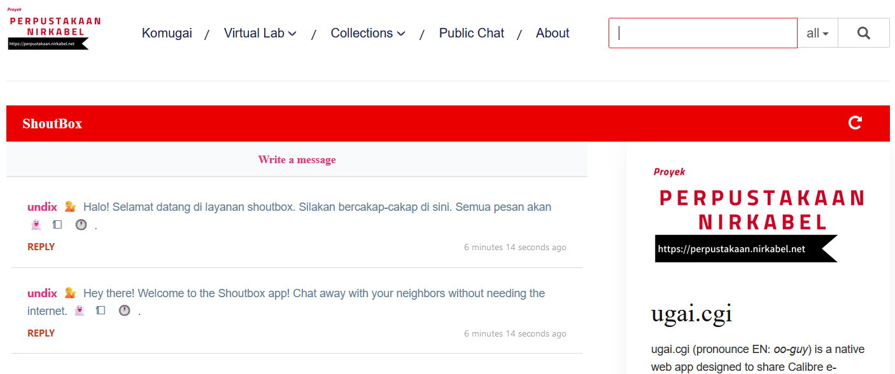
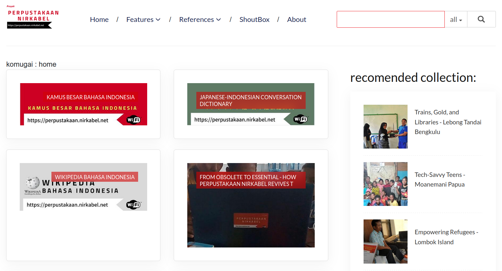

# Ugai.cgi


**Transform the most makeshift router into a High-Efficiency Digital Library with `Ugai`**

If you're looking to set up home NAS storage for private collections, sharing only with family or guests (not strangers on social media), `ugai.cgi` is the perfect choice. It's also ideal for teachers and trainers, offering an affordable alternative to whiteboards and expensive projectors, turning smartphones into small presentation screens.

Pronounced *ooh-guy*, this application enables rapid sharing of multimedia collections through any old router. With `ugai.cgi`, you can establish a portable, Calibre wireless server in under a minute. No advanced IT skills required! Just type *4 simple commands* on terminal.

Born from a decade of experience in creating wireless digital libraries for remote Indonesian communities, this budget-friendly innovation costs only about $10 per unit. Perfect for volunteers and educators in resource-strapped areas, `ugai.cgi` is more than just a digital bookshelf; it also provides bite-sized, Instagram-style micro-learning experiences, making education both accessible and engaging.

[](http://www.youtube.com/watch?v=q8KNBix4JUY "Installation Video")

This video is intentionally presented without sound, adhering to the principle that 'actions speak louder than words'. Please activate closed captions for detailed descriptions of the actions on screen. Closed captions are available in multiple languages, with Bahasa Indonesia as the default setting.

What's New?
===========
Discover the unique features of this system compared to other wireless server systems utilizing a router as a mini web server:

- **Instant Installation**: Get up and running in less than a minute! With just four simple command lines in the console, even beginners can easily set up `ugai.cgi`.

- **Effortless Setup**: Say goodbye to complicated setups! `ugai.cgi` operates directly on the hardware without needing a `rootfs` system. Perfect for beginners, it simplifies the process and boosts energy efficiency.

- **Broad Compatibility**: Whether you use EXT4 or FAT32 partitions, `ugai.cgi` works seamlessly with all modern operating systems. Capable of handling up to 1TB (tested) and a maximum of 2TB (MBR partition limit), content modification is a breeze.

- **Seamless Calibre Integration**: Manage your digital content effortlessly with Calibre integration. The system offers a user-friendly interface through the Calibre Desktop app version 3.4.80.

- **Blazing Fast Performance**: `ugai.cgi`, optimized for Linux OpenWRT 12.09, runs natively without the need for interpreters like Python, Perl, or PHP. This results in significantly faster performance and lower energy consumption.

- **Enhanced Database Support**: The 2024 edition of `ugai.cgi` can handle multiple Calibre databases simultaneously. This improves performance by distributing data across separate databases, perfect for managing large collections within MBR partition limits.

- **Educational and Open Source**: The `ugai.cgi` web server code and `ugai.kom` shoutbox application are freely available under the MIT license. This provides an excellent resource for students to learn HTML, CSS, JavaScript, and server management—cost-effective, energy-efficient, and quick to deploy.



Getting Started
===============
### Firmware
Download the OpenWRT 12.09 firmware that includes USB/HDD media reader integration in the kernel to simplify installation. Choose the firmware appropriate for your router. Incorrect installation at this stage can permanently damage your router (`bricked`). Below are the recommended routers based on real-world experience, cost-effectiveness, and ease of use.

* [TP-Link MR3420 V1 FAT32](http://stable.openwrt.piratebox.de/usb_only/openwrt-ar71xx-generic-tl-mr3420-v1-squashfs-factory.bin)
This is the most economical tool for managing up to 128GB on USB flash drives and up to 250GB on hard drives. It cost total only 18 US dollar with 320GB brand new SATA hardisk. If you using reused SATA hardisk, this cost will be cheaper.

* [TP-Link WR1043nd V1 FAT32](http://stable.openwrt.piratebox.de/usb_only/openwrt-ar71xx-generic-tl-wr1043nd-v1-squashfs-factory.bin) | [TP-Link WR1043nd V1 EXT4](http://stable.openwrt.piratebox.de/ar71xx_AA_BB_0.1/openwrt-ar71xx-generic-tl-wr1043nd-v1-squashfs-factory.bin)   
This device is suitable for heavy usage with data needs up to 1TB.

* [TP-Link MR3020 V1 FAT32](http://stable.openwrt.piratebox.de/usb_only/openwrt-ar71xx-generic-tl-mr3020-v1-squashfs-factory.bin) | [TP-Link MR3020 V1 EXT4](http://stable.openwrt.piratebox.de/ar71xx_AA_BB_0.1/openwrt-ar71xx-generic-tl-mr3020-v1-squashfs-factory.bin)     
Ideal for creating a mobile wireless server powered by a power bank or a static wireless server running on solar panels with small battery pack. MR3020 consume around 1-watt-hour. Since ugai.cgi does not operate using the rootfs method, there is a minimal chance of system failure in the event of a sudden power outage or a drop in current. You can be more confident using `ugai.cgi` to run a digital wireless library on a remote island with only solar panels as your power source, compared to other systems that operate over `rootfs`.

[This video show exactly how to flash.](https://youtu.be/q8KNBix4JUY?si=8PgCVmA1Cq0cCT60&t=14)

### Storage Media
The `ugai.cgi` system handles size seamlessly. However, performance degrades when a single Calibre database system exceeds 7,000 collections, each with more than 10 keywords. But you can split yout collections into diferent Calibre database system. Assume you have 1TB and hundreds thousands video, music, ebook; then you can split by media type. If your collection, let's say, videos exceeds 7.000, then you can split videos by subject. Therefore, the choice of storage media depends more on the router's ability to supply power. 

Generally, only the WR1043nd is stable enough for using a 2.5-inch SATA hard disk, provided its power consumption is below 1,000 mA. The MR3420 can handle up to a 320GB 2.5-inch SATA hard disk. The MR3020 is suitable for USB drives up to 128GB.

Format the storage media with the FAT32 system in a single partition.

### Download the Code

#### For MacOS/Linux

Open terminal and type:

```bash
git clone https://github.com/undix/ugai.git
```

#### For Windows 10

##### Using Git from Microsoft Windows PowerShell:

```bash
Windows PowerShell
Copyright (C) Microsoft Corporation. All rights reserved.

Install the latest PowerShell for new features and improvements! https://aka.ms/PSWindows

PS C:\Users\srisu> cd F:\
PS F:\> git clone https://github.com/undix/ugai.git
Cloning into 'ugai'...
remote: Enumerating objects: 732, done.
remote: Counting objects: 100% (370/370), done.
remote: Compressing objects: 100% (258/258), done.
remote: Total 732 (delta 139), reused 239 (delta 94), pack-reused 362
Receiving objects: 100% (732/732), 14.13 MiB | 802.00 KiB/s, done.
Resolving deltas: 100% (223/223), done.
Updating files: 100% (196/196), done.
PS F:\>
```

#### Using link from browser
* Click [https://github.com/undix/ugai/archive/refs/heads/main.zip](https://github.com/undix/ugai/archive/refs/heads/main.zip)
* Extract and rename the directory to `ugai`. Ensure the directory structure on the storage media is as follows:

```text
ugai
├── documents
├── install
└── www
```

### Configuration
#### config.txt
Users can modify the configuration file named `config.txt` using a text editor like Notepad. The default demo settings are as follows:

```text
current_ip_address='192.168.1.1'        # OpenWRT default
my_ip_address='192.168.1.1'             # your new ip address, default 192.168.1.1
my_time_zone='WIB-9'                    # change to your actual timezone, default UTC+9
my_server_domain='komugai.lan'          # domain and hostname
my_ssid="'Komugai'"                     # SSID change as you pleased
my_ssid_passwd="none"                   # SSID password, default none means passwordless
my_partition='/dev/sda1'                # your partition, do not change unless necessary
my_mount_point='/mnt/usb'               # your mount point, do not change unless necessary
my_format='vfat'                        # vfat OR ext4 
my_max_clients=32                       # maximum clients at a time

```

### config.json

Change this value if necessary. 
* server - server IP address or name, must exactly the same as `config.txt` above
* dir - directory where you put all off Calibre database (physical or just link)
* name - default Calibre database as **home**

You will have error page if `ugai.cgi` failed to find default Calibre database as `home`.

```json
{
	"server": "http://192.168.1.1",
	"dir": "data", 
	"name": "komugai"
}
```
This file will be rename to `.config.json` every boot. If you need to change later, change your Windows file manager view with CTRL+H to display all hidden files and directories. 

#### navigation.txt
This is navigation system that displayed on web page.
Users who are not familiar with HTML can also modify the navigation system. The editable configuration file is `navigation.txt`, which uses more-less Markdown rules. Example:

```text
db=komugai, Home
# Features
## tags=ebooks&db=komugai, E-books
## tags=laboratorium&db=komugai, Virtual Lab
# References
## titles=Wikipedia Bahasa Indonesia&db=komugai, Wikipedia Indonesia
## titles=Kamus Besar Bahasa Indonesia&db=komugai, KBBI
## titles=Indonesian Glossary&db=komugai, Indonesian Glossary
## titles=English-Indonesian dictionary&db=komugai, English-Indonesian
## titles=Indonesian English dictionary&db=komugai, Indonesian English
## titles=Arabic-Indonesian Conversation Dictionary&db=komugai, Arabic-Indonesian
## titles=Chinese-Indonesian Conversation Dictionary&db=komugai, Chinese-Indonesian
## titles=Dutch-Indonesian Conversation Dictionary&db=komugai, Dutch-Indonesian
## titles=French-Indonesian Conversation Dictionary&db=komugai, French-Indonesian
## titles=German-Indonesian Conversation Dictionary&db=komugai, German-Indonesian
## titles=Italian-Indonesian Conversation Dictionary&db=komugai, Italian-Indonesian
## titles=Japanese-Indonesian Conversation Dictionary&db=komugai, Japanese-Indonesian
## titles=Korean-Indonesian Conversation Dictionary&db=komugai, Korean-Indonesian
## titles=Portuguese-Indonesian Conversation Dictionary&db=komugai, Portuguese-Indonesian
## titles=Russian-Indonesian Conversation Dictionary&db=komugai, Russian-Indonesian
## titles=Spanish-Indonesian Conversation Dictionary&db=komugai, Spanish-Indonesian
titles=ShoutBox&db=komugai, ShoutBox
series=About Perpustakaan Nirkabel Project&db=komugai, About
```

Each time the router boots, it will read and translate this text into HTML format. This structure is easier for lay users to understand than HTML tag-based coding systems. Let's compare with actual HTML after translation below:

```html
<ul class="navbar-nav mx-auto mt-3 mt-lg-0">
  <li class="nav-item"> <a class="nav-link" href="?db=komugai">Home</a></li>
  <li class="nav-item dropdown">
    <a class="nav-link dropdown-toggle" href="#" role="button" data-toggle="dropdown" aria-haspopup="true" aria-expanded="false">Features</a>
    <div class="dropdown-menu">
      <a class="dropdown-item" href="?tags=ebooks&db=komugai">E-books</a>
      <a class="dropdown-item" href="?tags=laboratorium&db=komugai">Virtual Lab</a>
    </div>
  </li>
  <li class="nav-item dropdown">
    <a class="nav-link dropdown-toggle" href="#" role="button" data-toggle="dropdown" aria-haspopup="true" aria-expanded="false">References</a>
    <div class="dropdown-menu">
      <a class="dropdown-item" href="?titles=Wikipedia Bahasa Indonesia&db=komugai">Wikipedia Indonesia</a>
      <a class="dropdown-item" href="?titles=Kamus Besar Bahasa Indonesia&db=komugai">KBBI</a>
      <a class="dropdown-item" href="?titles=Indonesian Glossary&db=komugai">Indonesian Glossary</a>
      <a class="dropdown-item" href="?titles=English-Indonesian dictionary&db=komugai">English-Indonesian</a>
      <a class="dropdown-item" href="?titles=Indonesian English dictionary&db=komugai">Indonesian English</a>
      <a class="dropdown-item" href="?titles=Arabic-Indonesian Conversation Dictionary&db=komugai">Arabic-Indonesian</a>
      <a class="dropdown-item" href="?titles=Chinese-Indonesian Conversation Dictionary&db=komugai">Chinese-Indonesian</a>
      <a class="dropdown-item" href="?titles=Dutch-Indonesian Conversation Dictionary&db=komugai">Dutch-Indonesian</a>
      <a class="dropdown-item" href="?titles=French-Indonesian Conversation Dictionary&db=komugai">French-Indonesian</a>
      <a class="dropdown-item" href="?titles=German-Indonesian Conversation Dictionary&db=komugai">German-Indonesian</a>
      <a class="dropdown-item" href="?titles=Italian-Indonesian Conversation Dictionary&db=komugai">Italian-Indonesian</a>
      <a class="dropdown-item" href="?titles=Japanese-Indonesian Conversation Dictionary&db=komugai">Japanese-Indonesian</a>
      <a class="dropdown-item" href="?titles=Korean-Indonesian Conversation Dictionary&db=komugai">Korean-Indonesian</a>
      <a class="dropdown-item" href="?titles=Portuguese-Indonesian Conversation Dictionary&db=komugai">Portuguese-Indonesian</a>
      <a class="dropdown-item" href="?titles=Russian-Indonesian Conversation Dictionary&db=komugai">Russian-Indonesian</a>
      <a class="dropdown-item" href="?titles=Spanish-Indonesian Conversation Dictionary&db=komugai">Spanish-Indonesian</a>
    </div>
  </li>
  <li class="nav-item"> <a class="nav-link" href="?titles=ShoutBox&db=komugai">ShoutBox</a></li>
  <li class="nav-item"> <a class="nav-link" href="?series=About Perpustakaan Nirkabel Project&db=komugai">About</a></li>
</ul>
```

#### secured

This blank file set server status. If renamed to **.secured**, server run in production mode with UUID as parameter, otherwise server run in development mode that display `id` as `integer`.


### Install

Make sure you have file `install.txt` inside directory **install**. 

* Turn on the router with the storage media attached and connect using the command:

```bash
telnet 192.168.1.1
```

* Continue the setup by typing the `mount` command and executing the installation script as follows:

```bash
mkdir -p /mnt/usb
mount -t vfat /dev/sda1 /mnt/usb 
cd /mnt/usb/ugai/install
sh setup.sh

```

Done. Next, check for the SSID named `Komugai` and type `http://192.168.1.1` from your browser.


Recommended Data Size
=====================
- **TP-Link MR3020**: Limit to fewer than 1,000 entries, with a maximum of 3 tags per collection.
- **TP-Link MR3420**: Limit to fewer than 5,000 entries, with a maximum of 3 tags per collection.
- **TP-Link WR1043ND**: Limit to fewer than 10,000 entries, with a maximum of 3 tags per collection.

The Calibre database itself virtualy has no total limit while using `ugai.cgi`.
However, restrictions apply to the total number and logic of items in the `navigation` menu and the available media storage size.

Example Scenario
================
Imagine you have a collection of 17,000 educational textbooks in PDF format, officially issued by your country's Ministry of Education as standard text book. You intend to store these on an MR3420 server for high school use. Additionally, you have hundreds of educational videos created by local high school teachers.

**Organize Your Collection:**
1. **Segment by Reader Level:** Since these resources are for a high school, separate any non-high school materials into a different Calibre database.
2. **Manage Excess Volumes:** If the collection of high school-appropriate ebooks (or teacher-created videos) exceeds 5,000 items, further divide them by subject (e.g., Physics, Chemistry, Biology, Sociology, Economics, etc.). Calibre it self has excelent tools to do this job easily. This step will be more easier if you already set tags for each item base on subject. Again, Calibre it self has excelent tools to do this job easily.

Your directory will appear as follows:

```text
ugai
├── install
└── www
    └── data
        ├── elementaryschool
        ├── highschool_biology
        ├── highschool_chemistry
        ├── highschool_economy
        ├── highschool_history
        ├── highschool_physics
        ├── komugai
        ├── midschool
        └── references
```

Next, rewrite `navigation.txt` as follows using you text editor (Notepad, GEdit, nano, dll)

```text
db=komugai, home
# Text Books
## db=highschool_biology, biology
## db=highschool_chemistry, chemistry
## db=highschool_economy, economy
## db=highschool_history, history
## db=highschool_physics, physics
# Bonuses
## db=midschool, midschool
## db=elementaryschool, elementaryschool
## db=references, references
```

Plug your USB/HDD into MR3420 and power-on. 

Maintenance
===========
## Add/Delete/Edit Calibre Data
After making changes to data (such as adding, deleting, renaming, etc. from Calibre), create a blank file named `index.txt` inside the *ugai\install* directory, and then return your media to the router. 

```text
ugai
└── install
    └── index.txt
```

Whenever `index.txt` is found, the system will generate index files for each database to enhance response times. During this process, the system will be very busy and may not be able to handle any requests. After the index files are generated, the system will reboot, and operations will return to normal.

## Upgrade
If you need to upgrade the `ugai.cgi` file while keeping your customized design, simply download file [ugai.cgi](https://github.com/undix/ugai/blob/main/www/ugai.cgi) and [ugai.kom](https://github.com/undix/ugai/blob/main/www/ugai.kom) then replace the existing one. 

## Reinstall
If there are issues with the current version, you can reinstall while preserve your own Calibre data by following these steps:
- Create a blank text file named `reset.txt` and save into directory **ugai\install**.

```text
ugai
└── install
    └── reset.txt
```

- Start the router as usual to reset it. Power off router and put back your USB/SSD/HDD to computer. Wait until reboot and put back your storage into computer.
- If you have existing Calibre data, move the **data** directory and `navigation.txt` file to a location *outside* of the `ugai` directory.

```text
navigation.txt
data
ugai
└── install
└── www
```

- Delete or rename the `ugai` directory.
- Download the new source code from GitHub.
- Replace **www\data** directory with your backup and also replace `navigation.txt` inside directory `ugai\install`.
- Follow the installation instructions as previously described to set up a fresh system with your Calibre data and navigation menu intact.

This process will ensure you have a clean installation while preserving your custom and navigation data.

Problem with Calibre Version
============================
The Calibre Desktop Application, starting from version 4, utilizes sqlite3 features that are not supported by the version used in OpenWRT 12.09. Therefore, to avoid any issues when running the "ugai" webapp, please use Calibre Desktop Application version 3.48. To obtain version 3.48 (2019), you need to remove your current Calibre app first and downgrade to 3.48 from [Calibre repositori](https://download.calibre-ebook.com/3.48.0). If you are already have Calibre newer than 3.48 and reluctant to downgrade, you can choose portable edition (Windows 64-bit only). 

If you've never used Calibre before, you can find plenty of tutorials on the internet, including on YouTube. For more tailored assistance, consider joining the [Calibre community](https://www.mobileread.com/forums/forumdisplay.php?f=166).

Common Error Cases
==================
#### ERROR 503: Server not respond
- Make sure your data readable. Change mode to 755 (`chmod -R 777 ugai\www\data`) ussually works.
- Make sure `ugai.cgi` and `ugai.kom` executable. Change mode to `+x` (`chmod +x ugai\www\ugai.cgi` and `chmod +x ugai\www\ugai.kom`) ussually works.
- Make sure your server is not in `extremelly busy status`, in example, when still reindex process.

#### Page Not Displayed / CGI Error
- Ensure that all entries in `config.json` are absolutely correct.

#### Web Running but Not Displaying Entries from Calibre
- Double-check `config.json` to ensure the "server" value is correctly configured.

#### Cannot Find `config.json`
- Enable your file manager to show all hidden files and directories by pressing CTRL+H.
- Upon boot, the `ugai.cgi` environment automatically renames `config.json` to `.config.json`.

#### Running Too Slow
- The more active users there are, the more resources are required, which are already limited (512 MB memory). Consider reducing the number of items in your Calibre database.
- Create a new Calibre database within the `data` directory, then `move` (copy-and-delete) items into this new database based on criteria like subject, format, publisher, authors, pulished date, tags, etc.
- Remember to register your new database in `navigation.txt` to display it in the navigation panel.

#### Incomplete Item
- A collection will not be displayed if it lacks a cover, comments/description, or file attachment.
- If you need just a single page (similar to a blog post), use the Calibre feature to add a blank file (TXT).
- If you don't have cover, use Calibre built-in feature to make cover.

About
=====


### Ugai
Imagine `ugai.cgi`, pronounced `ooh-guy`, as the brain of a person. Just like your brain helps you think and do your schoolwork, `ugai.cgi` helps organize all the digital books in a special library called Calibre. It makes sure everything in the library works just right, so you can read and learn without any problems. `Ugai.cgi` is super important because it keeps the library running smoothly. In the real world, the name `ugai` refers to a hamlet on Siberut Island in the Mentawai Islands, Indonesia, meaning "home."

### Komugai
Now, think of Komugai, pronounced `co-mooh-guy`, as the body of a person, including the clothes they wear. Imagine you can change your outfits anytime you like. Komugai decides how the online library looks and feels, kind of like how you pick your clothes every day. If you wear different clothes, you're still you, but you might not look like you belong to a specific group, like your school or a sports team, unless you wear their standard outfit. Komugai helps make the library easy to use and nice to look at, just like how your favorite outfit makes you feel good. Under the MIT License, you can change the "clothes" any way you want, as long as you still show the original creator's "brand" on your clothes. In short: `ugai` is the brain of Kom`ugai` 2024. You can keep using "Komugai" for your new "clothes" or pick a totally new name, but one thing is certain: you're still using `ugai.cgi` and need pay attention about it's upgrade version in the future. 

The prefix `kom` in `Komugai` stands for communications. The `Komugai` server is specifically designed to operate in remote areas and can function off-grid without an Internet connection. Equipped with a shoutbox application, `Komugai` serves as a communication tool for local communities. This feature is extremely valuable, especially during the COVID-19 pandemic, when classrooms in remote areas of Indonesia have been closed.

The term `komugai` also means 'creatively using available resources to solve problems.' This term is borrowed from the Mee ethnic group in Papua, Indonesia, and it aligns perfectly with the project's environmentally friendly goals.

### Perpustakaan Nirkabel
Finally, `Perpustakaan Nirkabel`, or the Wireless Library Project, is about what you do with this setup after it's installed. Starting from 2014, this project sends educational materials to people in remote places where it's hard to get such resources. It's like going out and helping other people learn new things, using your brain (Ugai) and your body (Komugai) to make a difference. If you use the tools and designs from ugai.cgi and Komugai but are helping out with a different group or in your own community, you're doing great work, but you're not officially part of the Perpustakaan Nirkabel Project. 

Also, if you download and use this setup for personal reasons (like learning HTML, JavaScript, jQuery, pentesting, office meeting room, even make personal profit) or just in your school, you're not considered part of the 'Perpustakaan Nirkabel' Project, but you're still a user of both `ugai.cgi` and `Komugai` digital wireless server system. Some people call this "social impact."

In short: `ugai.cgi` is the brain that makes everything work, Kom`ugai` is like your whole body and the clothes that make you unique, and Perpustakaan Nirkabel Project is how you use these tools to help others.

References
==========
More info about [ugai.cgi](https://perpustakaan.nirkabel.net/tampilkan/tagar/ugaicgi)

More info about [Perpustakaan Nirkabel](https://perpustakaan.nirkabel.net/tampilkan/tagar/perpustakaannirkabel)

SocMed: https://www.threads.net/@sri.sutyoko


